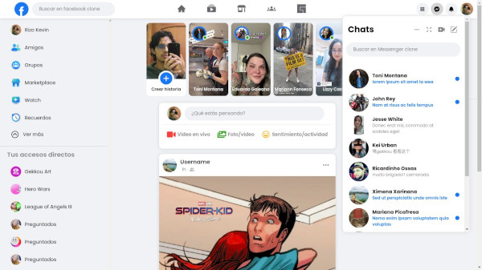

# facebook clone
A facebook front-end clone project made it on React + Vite, 
if all goes as planned it can end up being fullstack MERN project with express + graphql + mongoDB in the backend side... we'll see.

## Demo

<br />

<br />

## ⚠️ Warning! ⚠️
***This project is still incomplete, and under development,***
but if you wanna try it, clone it,

install the node dependencies

```
yarn install
```

Run the project

```
yarn dev
```

